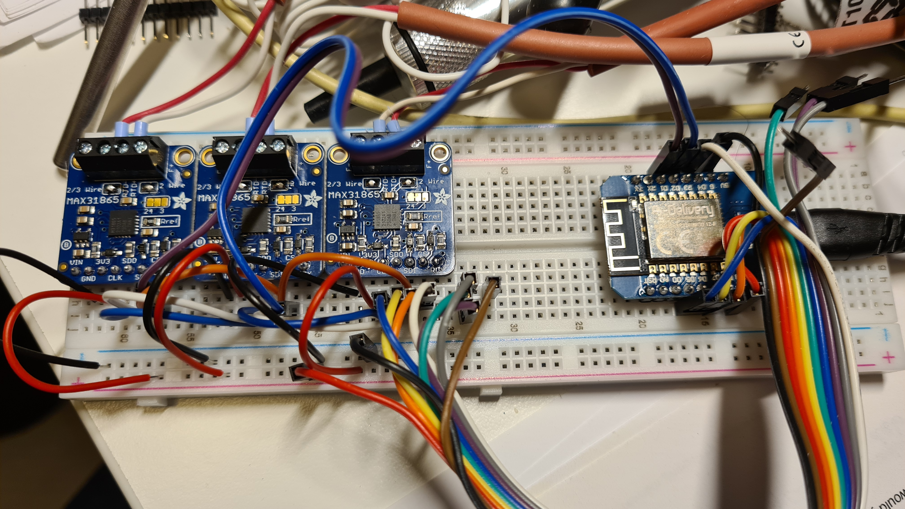
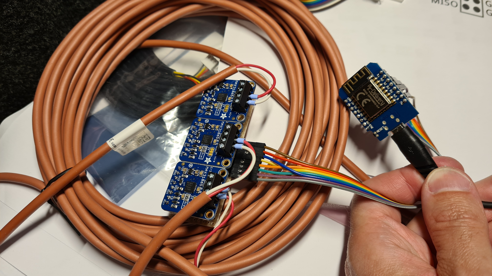

# esphome-solartemp
I have 3 heatpipe solar panel each with 30 tubes.
They are connected in series - but as the sun moves over the sky, some of them may get into the shadow on the late afternoon.
As the controller temp-sensor is only mounted on the last - it sometimes results in that the pump stops - and will not start again even if the two others still has sun on them and gets really hot.
To improve this - I have now put PT100 sensors in each of the 3 modules, and hooked them up to a ESP 8266 board.

The ESP is programmed with [ESPhome](https://esphome.io/), where it makes the data available on the built in web-interface, Exposing to Prometheus as well as bublishing the metrics to a MQTT but - that I then use to feed data the Solar controller module.
I did not want a fully wired solution as that can be sensitive to lightning, so just feeding low voltage power to the waterproof box I have outside - and letting it use the WiFi for data transfer works good.

## Hardware
Getting reliable high-res temp data from the PT1000 sensors was not that easy, especially as I had 3 of them.
Ended up with using PT1000 converters which gave me a very precise output digital signal that was easy to hook up to the ESP.

PT1000 sensors with Silicon cable to handle the heat. As my original idea was to use a multiplexer and some high-res A/D converter I used the 2-wire probes, but as I later went with the adapter-boards that supports 4-wire, that would have been a better option - as it gives even more precise values.

### Parts
D1 Mini - ESP8266 12-F board
Adafruit MAX31865 (PT1000 interface)
PT1000 sensors with silicon cables (4-wire prefered)


### Wiring D1Mini
#### Breadboard Testing


#### Final setup where sensors are connected to a PCB using headers.


I have some more images and a wiring diagram as well - somewhere.
Ping me if you want it - and I'll dig it up.

## Installation
Clone the repository and create a companion `secrets.yaml` file with the following fields:
```
wifi_ssid: <your wifi SSID>
wifi_password: <your wifi password>
solartemp_password: <Your p1mini password (for OTA, API, etc)>
```
Make sure to place the `secrets.yaml` file in the root path of the cloned project. The `p1mini_password` field can be set to any password before doing the initial upload of the firmware.

Flash ESPHome as usual, just keep the `p1mini.h` file in the same location as `p1mini.yaml` (and `secrets.yaml`). *Don't* connect USB and the P1 port at the same time! If everything works, Home Assistant will autodetect the new integration after you plug it into the P1 port.

If you do not receive any data, make sure that the P1 port is enabled on your meter and try setting the log level to `DEBUG` in ESPHome for more feedback.

## Technical documentation
Specification overview:
https://esphome.io/
https://www.amazon.se/AZDelivery-D1-Mini-ESP8266-12F-WLAN-modul/dp/B0754W6Z2F?th=1

https://www.adafruit.com/product/3648
